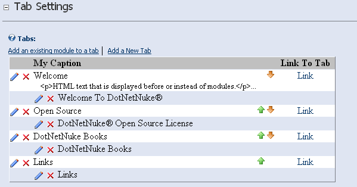
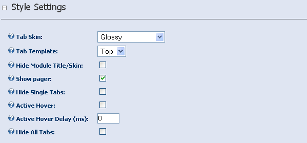

The Aggregator is capable of showing any number of tabs, each tab with
any number of modules within it. In addition to modules, each tab can
display it's own html text before the modules. You can include this text
in a tab without showing any modules at all if you wish, which
effectively turns the Aggregator module into a tabbed html text module.
The html text displayed in the tab is fully indexed by the internal DNN
search mechanism as well.

Tab Settings
------------

### Tabs

This area displays the current list of tabs and is used to set up the
tab/module structure of the Aggregator.

#### Add a New Tab

Allows you to create a new tab

-   **Caption** - the clickable text representing the tab
-   **Locale** - the locale you wish to limit display of this tab to
-   **Html Text** - html text to display inside the tab and before
    modules are shown

#### Add an existing module to a tab

Allows you to select a module from your current page (default) or from
another page on your site and add it to either a preexisting tab or to a
new tab

-   **Module** - the module you wish to add to the tab
-   **Locale** - the locale you wish to limit display to
-   **Insert Break** - selecting this option will force a break \ 
    tag between this module and the next module if you specify multiple
    modules with the tab
-   **Tab** - the tab you wish to add this module to. Selecting 'New
    Tab' will create a new tab with the same caption as the module title
    and add the module to it. This is quickest way to create new tabs.

Style Settings
--------------

#### Tab Skin

Use this setting to select the skin family of the tabs. Changing this
setting will affect the options you have available in the Tab Template
option below it. Tab skins are all implemented using CSS, html template
and javascript files and are located in the **/Skins** subfolder.

#### Tab Template

Use this setting to select from the number of templates depending on the
skin chosen above. This setting ultimately determines how the tabs are
laid out and how they will look. As of v5.0, a template system has been
created which allows for unprecedented freedom in styling your tabs.
Please see templating for a deeper discussion on how templates work.

#### Hide Module Title/Skin

If this option is checked, the containers for each module are hidden.

#### Show Pager

If this option is checked, a pager is shown. Depending on the
skin/template chosen it could show only previous and next links, or it
could show all page numbers including a first page/last page link etc.

#### Hide Single Tabs

If this option is checked, the tab portion will be hidden if there is
only 1 active tab showing after the tab/module locale settings have been
applied.

#### Active Hover

If this option is checked, the tabs will be selected based on the cursor
hovering over the tab instead of needing to click them manually.

#### Active Hover Delay

Use this setting to change how many milliseconds to wait before active
hover selects it's next tab. (1 second = 1000 milliseconds)

#### Hide All Tabs

Use this setting to hide the tab strip entirely. It seems counter
intuitive to need this but it is in fact very powerful when used in
conjunction with Aggregator targeting, that is, controlling a second or
third Aggregator from another

Target Settings
---------------

### Targets

Targets are other Aggregators that you wish to control from this
Aggregator. This is probably best explained by a sample scenario.

((( Let's say you have an Aggregator on your page that has 3 tabs, one
for each of your departments: Sales, Production and Finance. In each of
these tabs you might add some text about what each department does,
mission statement etc. Ok, now what if you could change the contents of
another module outside of your collection of tabs when each individual
tab was selected. This is exactly what the targeting functionality of
Aggregator was developed for. For instance you might want to show a
calendar of events for each department over in the right pane when you
click on the department. In this scenario you can add another Aggregator
to the page and a calendar for each of your 3 departments. Add each
calendar to it's own tab in the new Aggregator and turn on the 'Hide All
Tabs' option so it only shows one calendar. Now, in your first
Aggregator click 'Add a Target Aggregator' and add the Aggregator that
contains the calendars. Now, whenever you click on a tab in the first
Aggregator, the content of the other Aggregator will change with it. )))

#### Add a Target Aggregator

Allows you to select another Aggregator on the page for targeting.

